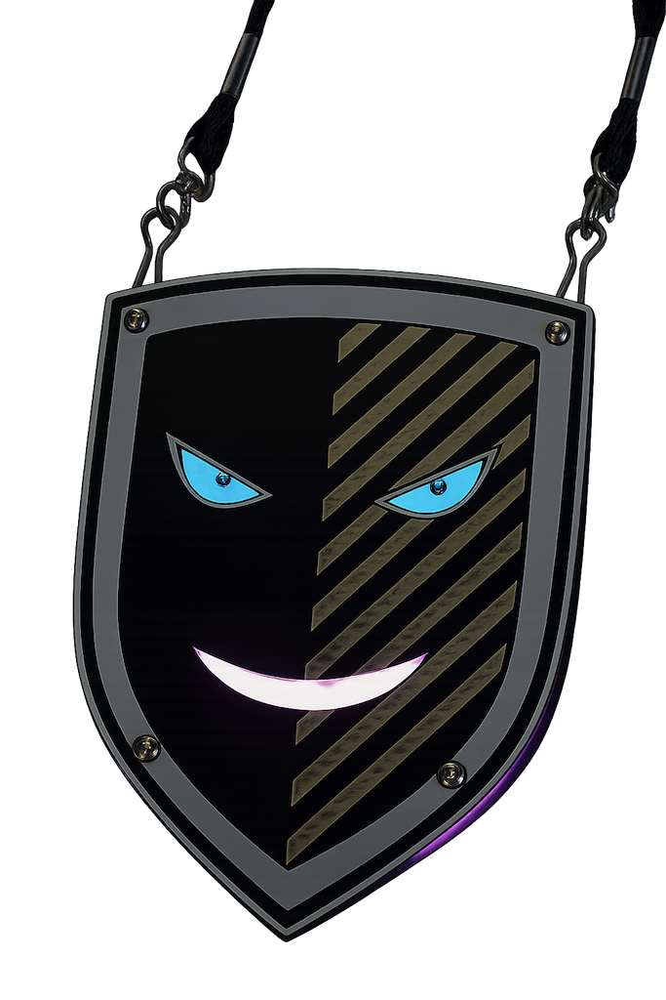

# Badge Sthack 2026

This electronic badge was designed for [Sthack 2026](https://sthack.fr) and given to every participant at the beginning of the CTF on May 29th, 2026.

| [User manual](firmware/README.md) | [Hardware](hardware/README.md) |
| --------------------------------- | ------------------------------ |

---

## Story

The badge was handed to you at the beginning of the CTF, eyes closed, lost in a paradoxical sleep, patiently waiting for the morning to wake up. But the night is long, and full of dreams and nightmares.

**Can you comfort it?**

---

## First boot

The badge starts in **sleep mode**. After powering on (confirmed by a beep), nothing happens. Its eyes are closed.

If you press a button, its eyes open for a brief moment, it sees you, then fall back shut. Nothing else. He's sleeping.

---

## Nightmares

During its sleep, the badge wakes up randomly every **5 to 15 minutes**. When a nightmare strikes:

- Its eyes turn sick and blurry
- It lets out its unique cry
- Its LEDs pulse red

**You have 20 seconds to react.**

Press any button to launch a minigame. Win the game to level up the badge: heart eyes, pink LEDs, a victory jingle, and the level number scrolled across the displays.

Miss the window and the nightmare passes without consequence, it will try again later.

**Reach level 10 to unlock the CTF flag.**

### Minigames

| Level | Game            | How to play                                              | Score required   |
| ----- | --------------- | -------------------------------------------------------- | ---------------- |
| 1     | **Stop**        | Stop the cursor inside the zone                          | 3 rounds         |
| 2     | **Dino**        | Jump over obstacles                                      | 5 obstacles      |
| 3     | **Maze**        | LEFT/RIGHT to rotate, CENTER to move forward             | Reach the exit   |
| 4     | **Pac-Man**     | Eat dots, avoid ghosts                                   | 20 points        |
| 5     | **Snake**       | LEFT/RIGHT, eat food without hitting borders or yourself | 10 points        |
| 6     | **Tetris**      | Clear horizontal lines                                   | 8 lines          |
| 7     | **Breakout**    | Destroy all bricks (5 lives)                             | Clear all bricks |
| 8     | **Simon**       | Memorise and repeat the button sequence                  | 8 rounds         |
| 9     | **Flappy Bird** | CENTER to flap through the pipes                         | 10 points        |
| 10    | **Mastermind**  | Deduce the hidden sequence                               | Find the code    |

---

## Wake-up

At the end of the night, a wake signal was broadcast to wake all badges simultaneously. Every badge that was still present opened its eyes, lit up its LEDs, played its unique melody.

From that point on, the badge is fully awake: eyes animated at all times, full menu accessible, all minigames unlocked, and customisation available.

Badges that had left the event before the signal remained asleep.

---

## Badge identity

Each badge has its own unique name, cry, and melody.
