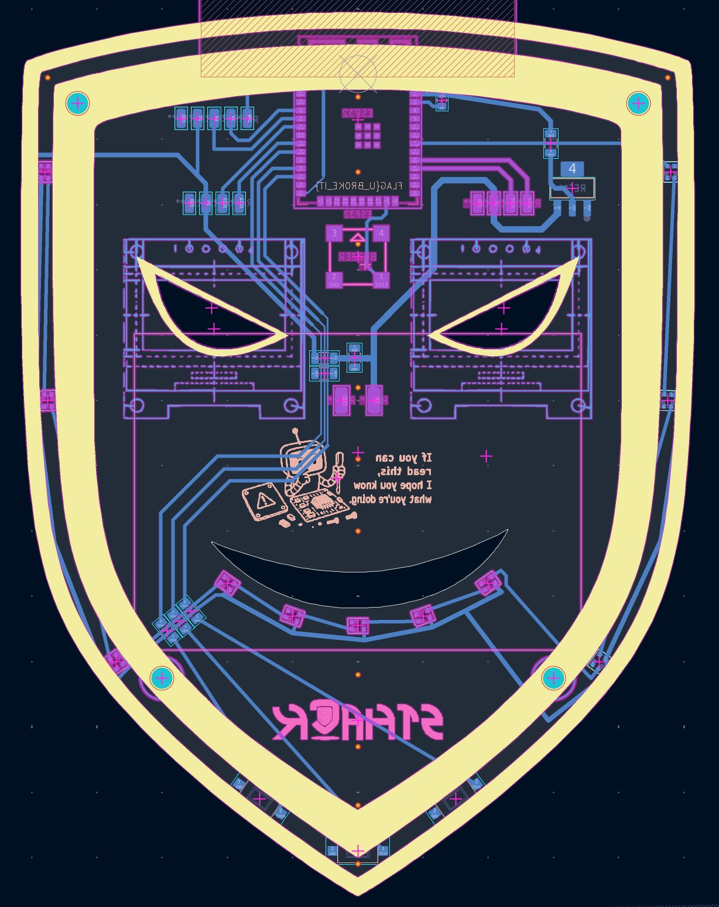
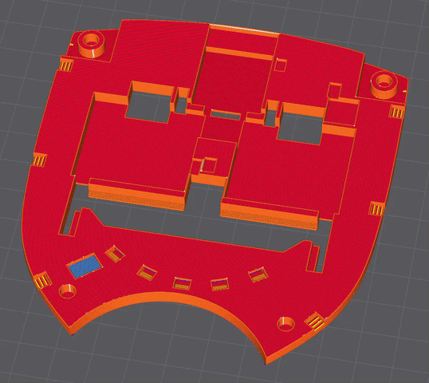
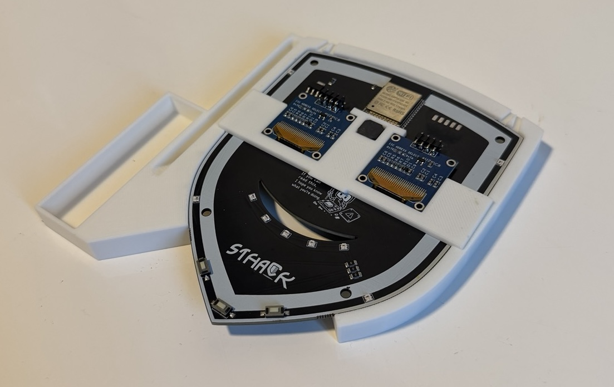
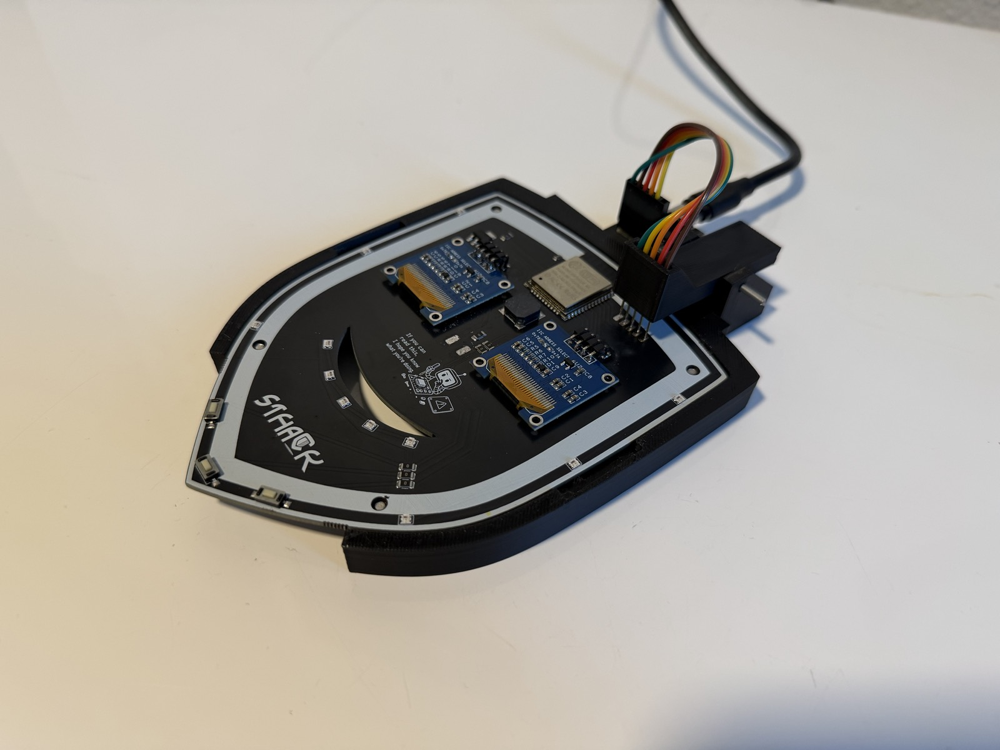
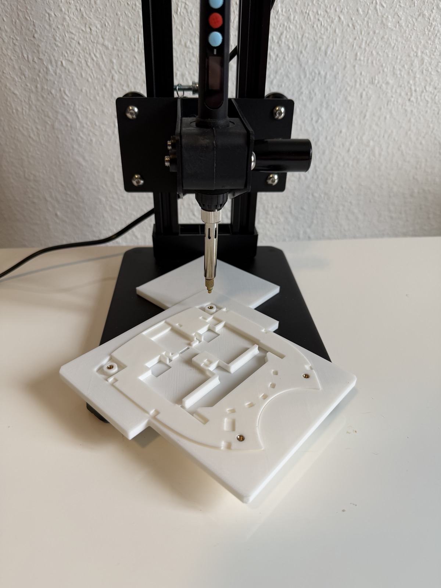
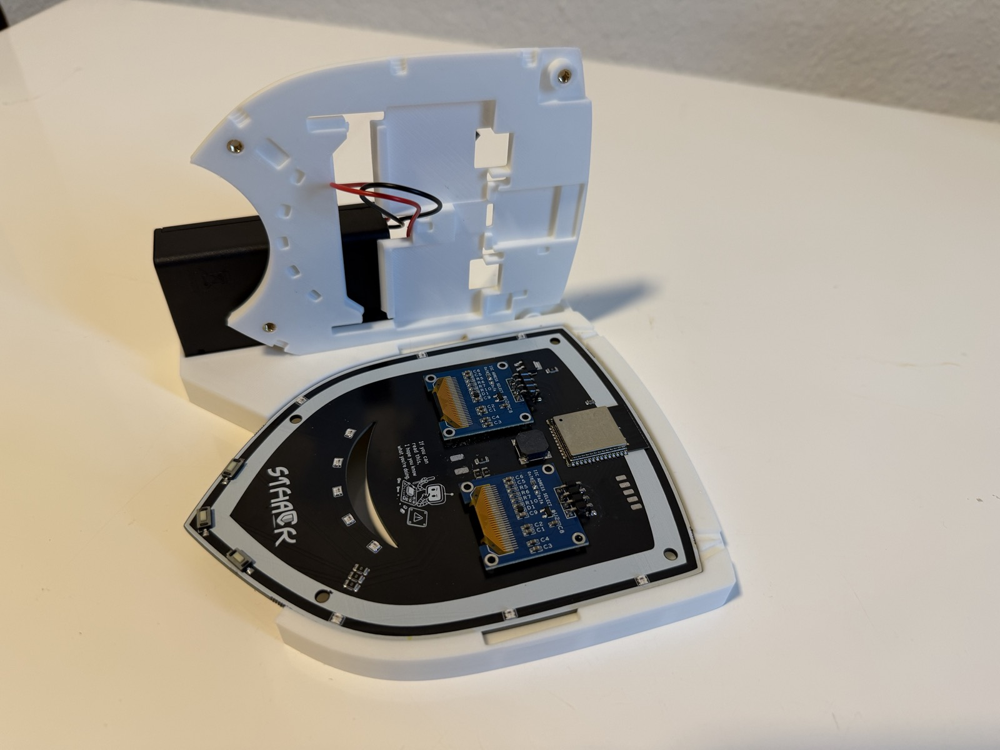
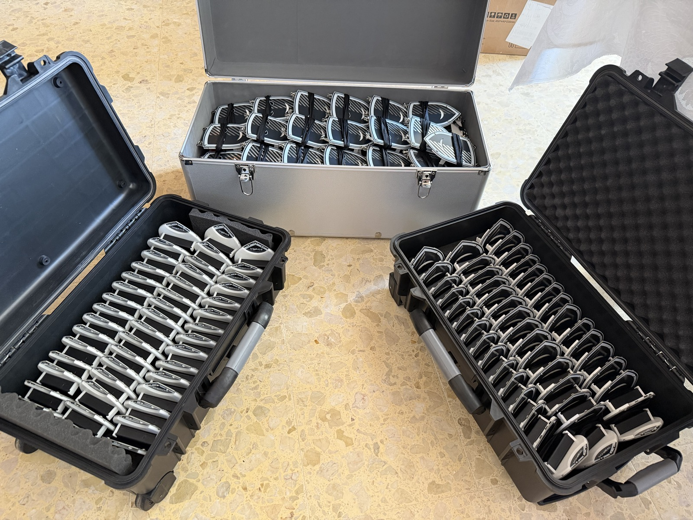

# Hardware



## Overview

The entire design, fabrication, assembly, and programming of 200 badges was completed in one month as a side project. With no time to run test batches before the final production run, every decision had to be right the first time. This shaped the approach: minimize risk by keeping the design simple and well-understood, rather than pushing boundaries that could not be validated in time.

---

## PCB

The [KiCad project](pcb/) is a two-layer SMD board shaped like the Sthack shield. All components are mounted on the back. The two OLED displays are soldered using U-shaped pin headers, keeping the front surface completely clean with no visible holes. This was a deliberate aesthetic choice.

---

## 3D printed plate

A 3D printed plate screws onto the back of the PCB and is shaped to fit around the components. It houses several integrated features:

- Small tunnels run behind the mouth LED strip to diffuse the light more evenly across the front.
- Two sliding brackets hold the AA battery box in place.
- A stop piece prevents the battery box from being pulled out too easily.
- The lanyard hooks are sandwiched between the plate and the PCB, held in place by the assembly itself without additional fasteners.



---

## Assembly process

### Screen soldering

A printed support and a plate hold both OLED displays at the correct height and angle during soldering, ensuring perfect alignment on every badge.



Files are in [`3D/soldering/`](3D/soldering/).

### Programming

Each PCB is placed into a custom-made programming dock that holds the badge at a fixed position, aligning a set of pogo pins with the programming pads on the board. This allows flashing the firmware without soldering any connector.



The dock is 3D printed. Files are in [`3D/programming/`](3D/programming/).

To speed up flashing 200 badges, a batch script ([`firmware/flash_batch.py`](../firmware/flash_batch.py)) flashes multiple badges in parallel across several USB ports. An audio feedback system plays distinct sounds to signal when a flash succeeds or fails, so there is no need to watch the screen between each badge.

### Brass thread inserts

The 3D plate uses heat-set brass inserts for the screw holes. A jig positions the plate precisely under the soldering iron tip to make insertion consistent.



Files are in [`3D/threads/`](3D/threads/).

### Final assembly

Components are positioned on the plate, the battery box wires are soldered to the PCB, and everything is secured with 4 screws, also holding necklace.





---

## Bill of materials

| Component | Reference                                              | Details                                                     |
| --------- | ------------------------------------------------------ | ----------------------------------------------------------- |
| SoC       | [ESP32-WROOM-32E](components-datasheets/C19949066.pdf) | 240 MHz, 4 MB Flash, 520 KB SRAM, BLE + WiFi                |
| Display   | [SSD1306](components-datasheets/SSD1306.jpeg) x 2      | 128x64 OLED, I2C @ 0x3C                                     |
| LEDs      | [WS2812B](components-datasheets/C965555.pdf) x 11      | 3 left ring + 5 mouth + 3 right ring, single GPIO data line |
| Buttons   | SMD push x 3                                           | Active-low, internal pull-up, Left / Center / Right         |
| Buzzer    | [Passive piezo](components-datasheets/C7544813.pdf)    | PWM via LEDC, ~2500 Hz resonance                            |
| Regulator | [AMS1117-3.3](components-datasheets/C6186.pdf)         | 3.3 V LDO regulator for the ESP32                           |
| Resistors | [0402](components-datasheets/C17888.pdf)               | Pull-up / current-limiting resistors                        |

---

## Pin assignments

| Signal            | GPIO |
| ----------------- | ---- |
| Left display SDA  | 19   |
| Left display SCL  | 21   |
| Right display SDA | 25   |
| Right display SCL | 26   |
| WS2812B data      | 32   |
| Button LEFT       | 18   |
| Button CENTER     | 17   |
| Button RIGHT      | 16   |
| Buzzer PWM        | 13   |

---

## LED segments

The 11 LEDs are wired in a single chain on GPIO 32:

```
Index  0  1  2        Left ring  (3 LEDs)
Index  3  4  5  6  7  Mouth strip (5 LEDs)
Index  8  9  10       Right ring (3 LEDs)
```
